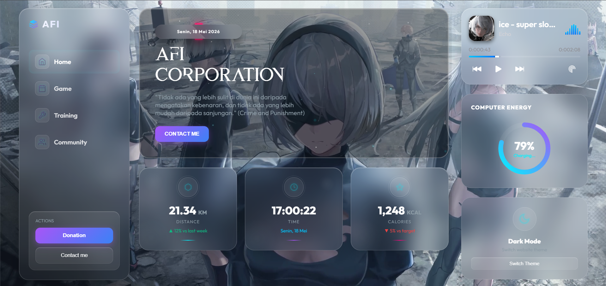

# ⚠️ PERINGATAN KERAS ⚠️

**JANGAN PERNAH MENCONTEK ATAU MENG-COPY WEBSITE INI!**
Jika Anda nekat melakukannya, kami tidak bertanggung jawab jika Anda tiba-tiba menjadi target operasi **Elit Global**. Tetaplah aman, hargai karya orang lain, dan jangan sampai tertembak! 🕵️‍♂️

---

## 👑 DEVELOPER MUTLAK

**Situs ini dirancang, dikembangkan, dan dimiliki secara mutlak oleh:**

* **Nama:** `AGUS FAISAL ISRO'I` 💻🔥
* **Tanggal Dibuat:** `18/05/2026` 📅

*Segala bentuk plagiarisme atau modifikasi tanpa izin adalah pelanggaran terhadap hukum semesta digital.*

---

## 📸 Preview

---

## 🌟 Seberapa Bagus Web Ini?

Web ini bukan sekadar website biasa. Ini adalah mahakarya UI/UX modern yang menggabungkan estetika masa depan dengan performa yang mulus. Berikut adalah alasan mengapa website ini sangat luar biasa:

### 1. Desain Ultra-Premium (Glassmorphism)

Website ini mengadopsi tren desain **Glassmorphism** tingkat lanjut. Efek kaca transparan, pendaran neon, blur latar belakang yang halus, dan bayangan dinamis memberikan kesan mewah dan futuristik.

### 2. Pengalaman Pengguna yang Mulus (SPA)

Dilengkapi dengan sistem **Single Page Application (SPA)**. Anda dapat berpindah dari halaman Home, Game, Training, hingga Community dengan instan tanpa ada jeda loading halaman yang mengganggu. Musik Anda akan tetap berputar tanpa terputus!

### 3. Fitur Real-Time yang Canggih

* **Waktu & Tanggal Akurat:** Menampilkan waktu real-time yang terus berdetak.
* **Computer Energy (Battery API):** Website ini mampu membaca sisa daya baterai perangkat Anda dan menampilkannya secara dinamis lengkap dengan animasi lingkaran progres.

### 4. Tipografi Khusus yang Unik

Menggunakan font kustom seperti **'Aspal'** dan **'Words Taken'** yang memberikan karakter kuat dan tidak pasaran pada teks judul dan brand Anda.

### 5. Fleksibilitas Tema

Mendukung mode Gelap (Dark) dan Terang (Light) yang dapat beralih dengan halus, memastikan kenyamanan mata pengguna dalam kondisi cahaya apa pun.

---

## 🛠️ Teknologi yang Digunakan

* **HTML5** - Struktur semantik yang rapi.
* **CSS3** - Custom properties, flexbox, grid, animations, dan filter efek kaca.
* **JavaScript (Vanilla)** - Logika navigasi SPA, manipulasi DOM, dan integrasi Battery API.

---
*Dibuat dengan penuh dedikasi untuk menciptakan pengalaman web terbaik.*
